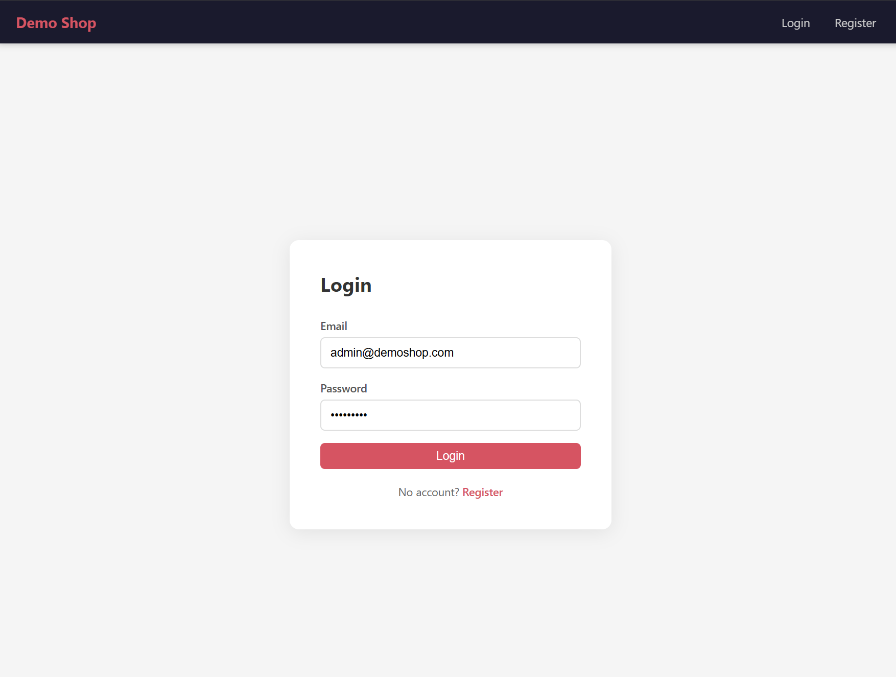
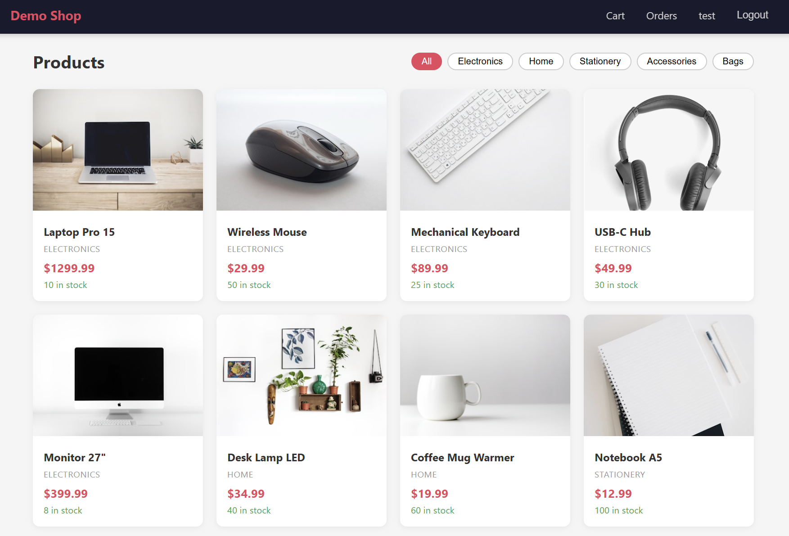

# Demo Shop

A demo e-commerce REST API and React frontend built for QA automation training. Covers a complete shopping flow: registration → browse products → cart → place order → pay (with success/failure simulation) → Kafka events.





## Stack

- **Backend:** Spring Boot 3.3, Java 21, PostgreSQL, Kafka, JWT auth, Flyway migrations
- **Frontend:** React 18, Vite, React Router v6, Axios, Nginx
- **Infrastructure:** Docker Compose

## Quick Start

### Option 1 — Pull from Docker Hub (no build required)

```bash
curl -O https://raw.githubusercontent.com/prkpchk/demo-shop/main/docker-compose.hub.yml
docker-compose -f docker-compose.hub.yml up
```

Or if you already have the repo:

```bash
docker-compose -f docker-compose.hub.yml up
```

Images used:
- [`prkpchk/demo-shop-api`](https://hub.docker.com/r/prkpchk/demo-shop-api)
- [`prkpchk/demo-shop-frontend`](https://hub.docker.com/r/prkpchk/demo-shop-frontend)

### Option 2 — Build from source

```bash
docker-compose up --build
```

| Service      | URL                                   |
|--------------|---------------------------------------|
| Frontend     | http://localhost                      |
| Backend API  | http://localhost:8080                 |
| Swagger UI   | http://localhost:8080/swagger-ui.html |
| Health check | http://localhost:8080/actuator/health |

## Default Seed Users

| Email              | Password | Role  | Balance   |
|--------------------|----------|-------|-----------|
| admin@demoshop.com | admin123 | ADMIN | $10000.00 |
| user@demoshop.com  | user123  | USER  | $1000.00  |

## API Overview

### Auth (public)

```
POST /api/v1/auth/register   { name, email, password }
POST /api/v1/auth/login      { email, password }
```

Response: `{ token, email, name, role }`

Pass the token as `Authorization: Bearer <token>` on all authenticated requests.

### Products (GET is public, write requires ADMIN)

```
GET    /api/v1/products          ?page=0&size=10&category=Electronics
GET    /api/v1/products/{id}
POST   /api/v1/products          { name, description, price, stock, category, imageUrl }
PUT    /api/v1/products/{id}
DELETE /api/v1/products/{id}
```

### Cart (authenticated)

```
GET    /api/v1/cart
POST   /api/v1/cart/items        { productId, quantity }
PUT    /api/v1/cart/items/{id}   { quantity }
DELETE /api/v1/cart/items/{id}
```

### Orders (authenticated)

```
POST /api/v1/orders              — place order from current cart
GET  /api/v1/orders              — list user's orders
GET  /api/v1/orders/{id}
POST /api/v1/orders/{id}/pay     ?simulateFailure=false
```

Payment simulation:
- `simulateFailure=false` (default) → order moves to `PAID`
- `simulateFailure=true` → order moves to `CANCELLED`, balance is refunded

### Users (authenticated)

```
GET  /api/v1/users/me
PUT  /api/v1/users/me            { name }
POST /api/v1/users/me/top-up     { amount }
```

## Kafka Events

Topic: `order-events`

| Event type        | Trigger                        |
|-------------------|--------------------------------|
| `ORDER_PLACED`    | Order successfully placed      |
| `PAYMENT_SUCCESS` | Payment processed (simulateFailure=false) |
| `PAYMENT_FAILED`  | Payment failed (simulateFailure=true)  |

Event payload: `{ orderId, userId, totalAmount, type, timestamp }`

## Running Tests

```bash
# Requires JAVA_HOME set and Maven available
mvn test
```

24 tests: service layer (OrderService, PaymentService) + controller layer (Product, Cart, Order, User).

## Running Locally (without Docker)

Start infrastructure:

```bash
docker-compose up postgres kafka
```

Run the app:

```bash
mvn spring-boot:run
```

Run the frontend dev server:

```bash
cd frontend
npm install
npm run dev   # http://localhost:3000
```

## Project Structure

```
demo-shop/
├── src/                        # Spring Boot backend
│   ├── main/java/com/demoshop/
│   │   ├── config/             # Security, JWT filter, CORS, exception handler
│   │   ├── controller/         # REST endpoints
│   │   ├── domain/             # JPA entities (User, Product, Cart, Order)
│   │   ├── dto/                # Request/response records
│   │   ├── kafka/              # OrderEvent, producer, consumer
│   │   ├── repository/         # Spring Data JPA repositories
│   │   └── service/            # Business logic
│   └── main/resources/
│       ├── application.yml
│       └── db/migration/       # Flyway V1–V5 (schema + seed data)
├── frontend/                   # React SPA
│   ├── src/
│   │   ├── api/                # Axios API clients
│   │   ├── components/         # Navbar, PrivateRoute, PaymentModal
│   │   ├── context/            # AuthContext
│   │   └── pages/              # CatalogPage, ProductPage, CartPage, OrdersPage, ProfilePage, LoginPage, RegisterPage
│   ├── nginx.conf
│   └── Dockerfile
├── Dockerfile                  # Backend multi-stage build
├── docker-compose.yml          # build from source: postgres, kafka, app, frontend
└── docker-compose.hub.yml      # pull from Docker Hub (no build needed)
```
